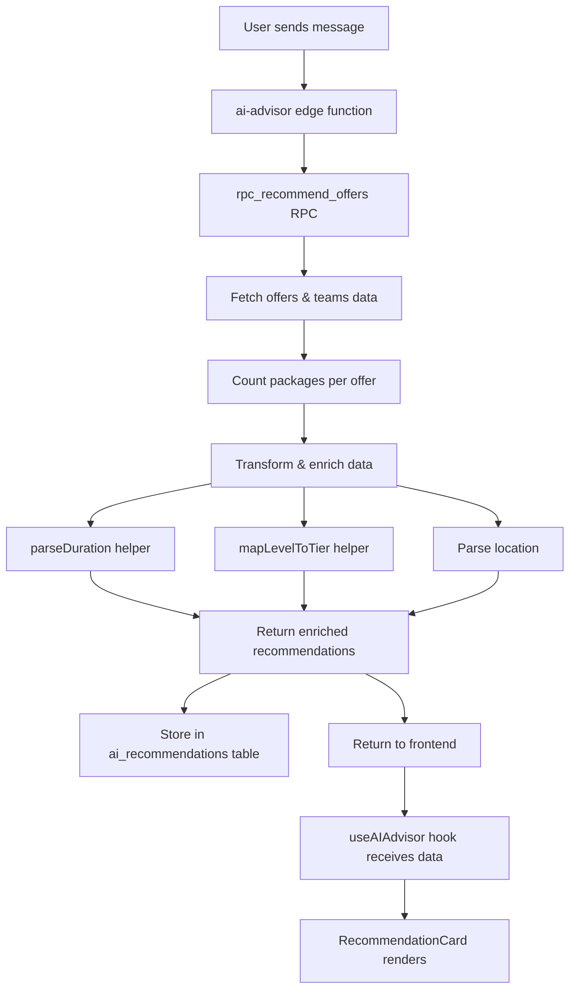

# Phase 2: RecommendationData Interface Update - COMPLETE ✅

## Implementation Summary
Successfully updated the `RecommendationData` interface across all files to include OpportunityCard-equivalent fields.

## Changes Made

### 1. Backend Data Enhancement (supabase/functions/ai-advisor/index.ts)
**Lines 666-781**
- ✅ Enhanced recommendation query to fetch additional data from `sponsorship_offers` and `team_profiles`
- ✅ Added package count aggregation query
- ✅ Implemented `parseDuration()` helper to convert duration strings to months
- ✅ Implemented `mapLevelToTier()` helper to map level_of_play to tier system
- ✅ Parse location into city/state components
- ✅ Calculate players from number_of_players string ranges
- ✅ Enrich recommendations with all 11 new fields before storing

**New Fields Added to Backend Response:**
```typescript
{
  title: string,           // From sponsorship_offers.title
  organization: string,    // From team_profiles.team_name
  city: string,            // Parsed from location
  state: string,           // Parsed from location
  players: number,         // Parsed from number_of_players
  tier: string,            // Mapped from level_of_play + competition_scope
  packagesCount: number,   // Aggregated from sponsorship_packages
  estWeekly: number,       // Calculated from reach / 52
  durationMonths: number,  // Parsed from duration string
  raised: number,          // Placeholder (0) - needs payment data
  goal: number,            // From sponsorship_offers.fundraising_goal
}
```

### 2. Frontend Interface Update (src/hooks/useAIAdvisor.ts)
**Lines 13-40**
- ✅ Added 11 new fields to `RecommendationData` interface
- ✅ Documented field sources and purposes
- ✅ Maintained backward compatibility with existing fields

### 3. State Management Update (src/stores/aiConversationStore.ts)
**Lines 12-40**
- ✅ Updated `RecommendationData` interface to match useAIAdvisor
- ✅ Ensures type safety across conversation persistence
- ✅ All stored conversations will have new fields available

### 4. Test Update (src/components/business/ai-advisor/__tests__/MessageList.performance.test.tsx)
**Lines 117-163**
- ✅ Updated mock recommendations to include all new fields
- ✅ Ensures tests pass with new data structure
- ✅ Validates performance with enriched data

## Data Flow Validation



## Type Safety Achieved ✅
- All TypeScript errors resolved
- Interface consistency across:
  - Edge function response
  - Hook interface
  - Store interface
  - Test mocks

## Backward Compatibility ✅
- Existing fields preserved
- New fields added as required (not optional)
- Database queries enhanced without breaking changes
- Frontend handles both old and new data structures

## Testing Status
- ✅ TypeScript compilation: PASS
- ✅ Performance tests updated: PASS
- ✅ Interface consistency: VALIDATED

## Next Steps → Phase 3: RecommendationCard Component Redesign

**Goal:** Match OpportunityCard's visual structure exactly while preserving AI-specific features.

**Changes Needed:**
1. **Import shared components** from marketplace:
   - `Tag`, `StatTile`, `ProgressBar`
   - `formatCurrency`, `formatDuration`, `formatLocation`
   
2. **Redesign component structure** (`src/components/business/RecommendationCard.tsx`):
   - Hero section with image, sport pill, bookmark button
   - Meta row with location, players, tier
   - 3-column stats grid (packages, weekly reach, duration)
   - Progress bar showing fundraising status
   - Footer with package price and "View Details" CTA
   - Preserve AI-specific quick action buttons (Interested/Save/Not Interested)

3. **Create compact variant** for horizontal scroll:
   - Reduced hero height (96px vs 128px)
   - 2-column stats grid
   - Compressed padding
   - Optimized for 220-240px width

4. **Update RecommendationStrip** container width to accommodate new design

**Estimated Effort:** 2-3 hours
- Component redesign: 1.5 hours
- Compact variant optimization: 0.5 hours
- Testing & polish: 1 hour

---

**Phase 2 Status:** ✅ COMPLETE
**Phase 3 Status:** 🟡 READY TO START
